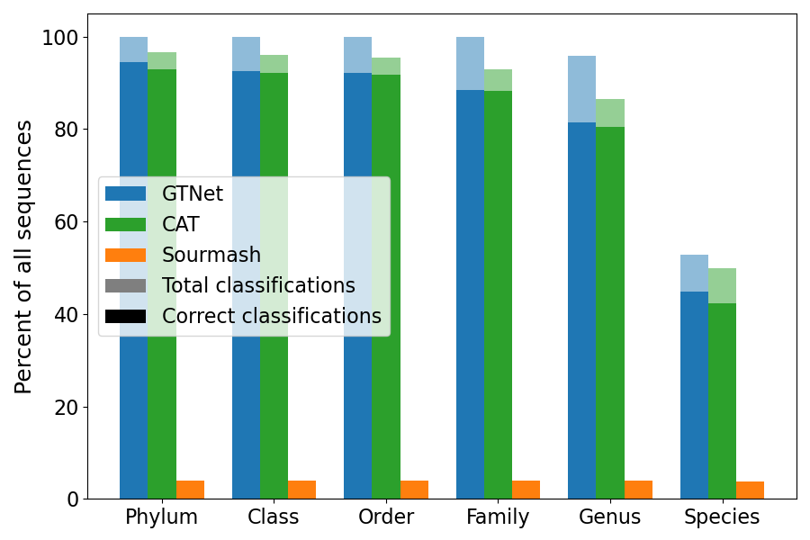
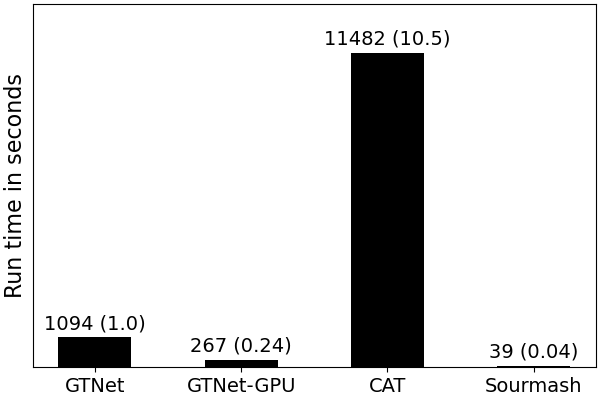

GTNet Performance
=================

.. Attention:: This page is currently under construction. The results presented here may not accurately reflect what is said in text.

Taxonomic classifiers fall into two main categories: fast-and-incomplete or slow-and-complete. GTNet strives to be
both fast and complete. In this page, we demonstrate GTNet capabilities by comparing to state-of-the-art methods
from each of these categories. We compare to `Sourmash <https://sourmash.readthedocs.io/en/latest/index.html>`_, a
fast-and-incomplete method, and `CAT <https://github.com/dutilh/CAT>`_, a slow-and-complete method.

Our choice of tools for comparison should not be perceived as a criticism or an endorsement for either tool. These
tools were chosen based on their ease of use for labelling contigs with the GTDB taxonomy and the algorithmic
approaches underlying these tools.

Here are accuracy comparisons for a subset of non-representative GTDB taxa.

Here are speed comparisons for a subset of 40 non-representative genomes.

